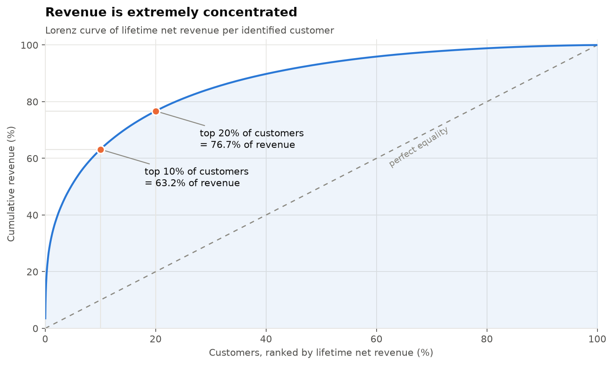
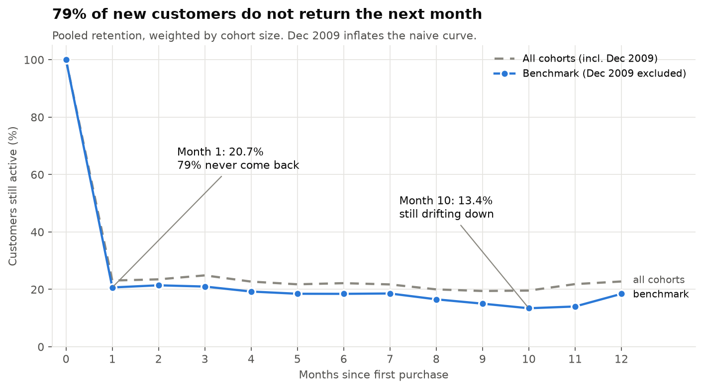
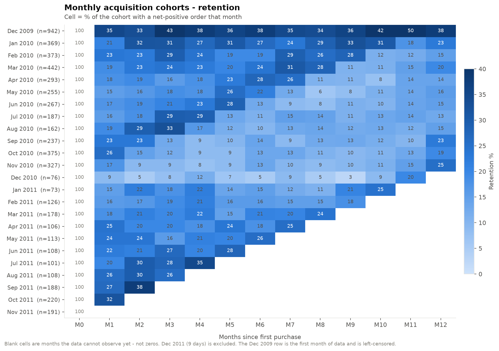
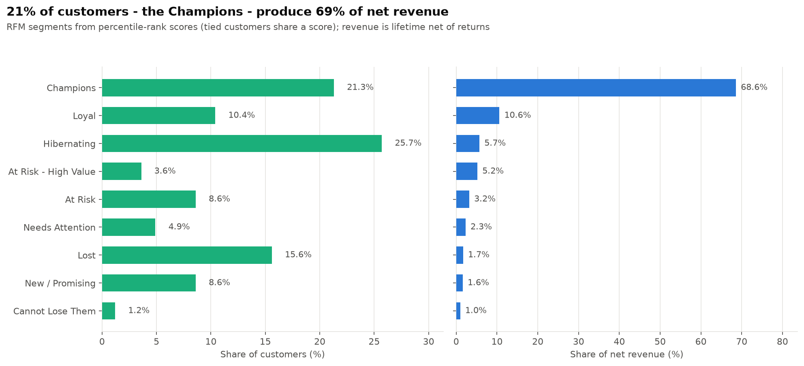

# Customer retention, RFM & revenue concentration: Online Retail II

**The question:** for a UK online gift wholesaler with two years of transactions,
*where does the revenue come from, and do customers come back?*

**The answer, in one sentence:**
> The top 10% of customers produce **63.2%** of customer revenue, and **79% of new
> customers never return the following month**; the ones who do keep drifting away
> (month-1 retention 20.7%, month 10 13.4%).

| | |
|---|---|
| Net revenue | **£18.93M** (net of 3.65% returns) |
| Identified customers | **5,832** |
| Top 10% of customers | **63.2%** of customer revenue (top 20%: 76.7%, bottom 50%: 6.6%) |
| Month-1 retention (benchmark) | **20.7%** |
| One-time buyers | **27.4%** of customers |
| Median vs mean customer value | **£844** vs £2,805 (heavily skewed, so quote the median) |
| Revenue with no customer ID | **13.6%** (£2.57M), invisible to every customer-level metric |

Full interactive report: [`outputs/dashboard.html`](outputs/dashboard.html) (self-contained, open in any browser) ·
Excel report: [`outputs/online_retail_customer_analysis.xlsx`](outputs/online_retail_customer_analysis.xlsx)

---

## Findings

### 1. Revenue is extremely concentrated


584 customers (the top 10%) produce 63.2% of customer revenue. The single largest
customer is 3.5% of it on their own. Five customers in EIRE generate ~3,500
transaction lines each, which is wholesale behaviour, not retail.

### 2. Retention: most new customers never come back


79% of new customers do not order again the following month. Retention then keeps
declining (13.4% by month 10) with a Christmas bump at month 12 (18.4%): a gift shop's
customers come back a year later. The benchmark excludes the December 2009 cohort
(see *Traps*, below); the dashed line shows how much that cohort inflates a naive curve.



### 3. RFM segments


| Segment | Customers | % of customers | Revenue | % of revenue | Avg orders | Avg days since last order |
|---|---:|---:|---:|---:|---:|---:|
| Champions | 1,245 | 21.3% | £11,222,195 | 68.6% | 17.4 | 20 |
| Loyal | 607 | 10.4% | £1,739,850 | 10.6% | 8.4 | 85 |
| Hibernating | 1,496 | 25.7% | £935,421 | 5.7% | 2.0 | 172 |
| **At Risk - High Value** | **210** | **3.6%** | **£851,441** | **5.2%** | **9.6** | **338** |
| At Risk | 503 | 8.6% | £521,020 | 3.2% | 3.8 | 368 |
| Needs Attention | 287 | 4.9% | £371,964 | 2.3% | 3.5 | 110 |
| Lost | 912 | 15.6% | £283,999 | 1.7% | 1.2 | 554 |
| New / Promising | 503 | 8.6% | £269,127 | 1.6% | 1.5 | 28 |
| Cannot Lose Them | 69 | 1.2% | £165,979 | 1.0% | 1.7 | 425 |

**The segment to act on is At Risk - High Value:** 210 customers who used to order
often (9.6 orders on average) and were worth £851K, but haven't ordered in 338
days on average. That's a named, costed win-back list. **New / Promising** is
where the month-1 retention cliff happens: getting these customers to a second
order is the single biggest lever.

---

## Method

### Exclusion ledger
Every removed row is counted and named. `src/03_clean.py` fails if the ledger does
not reconcile exactly. The rules are defined once, as flag columns in
`sql/01_clean.sql`, and the ledger counts those flags, so the rules and the ledger
can never disagree.

| Step | Rows | Why |
|---|---:|---|
| Raw rows (UCI published figure) | 1,067,371 | |
| − Duplicate rows (business key) | −34,337 | 22,202 from the two sheets overlapping on 1-9 Dec 2010, 12,135 exact copies within a sheet |
| − Non-product / service codes | −5,801 | postage, fees, manual adjustments, bad debt, test rows, gift vouchers (28 codes checked individually) |
| − Warehouse write-offs | −3,391 | negative quantity, no customer, not a cancellation; descriptions read "lost", "damaged", "wet" |
| − Zero or negative price | −2,572 | no revenue signal |
| **= Analysed** | **1,021,270** | **95.68% kept** |

The ledger is a waterfall: each row is counted under the *first* rule that removes it.

**Kept on purpose:**
- **Cancellations** stay in as negative revenue, so every total is net of returns.
- **Rows with no customer ID** stay in the fact table and are excluded only from the
  customer-level analyses that can't use them, so the gap (13.6% of revenue) stays measurable.
- **DCGS\*, SP\*, and PADS stock codes** are real products, even though they fail a naive
  "starts with 5 digits" rule.

### Traps found while building this
Each of these produces a wrong answer, not an error.

1. **The two Excel sheets overlap.** 1-9 December 2010 is in both, so 1,088 invoices
   were double-counted when the sheets were stacked. Fix: deduplicate on the business key,
   ignoring the sheet.
2. **Floating-point money.** With `DOUBLE`, a fully returned basket nets to ~1e-14 instead of
   0 and passes a `> 0` filter. Tested by switching to `DOUBLE` on purpose: 5 tests failed,
   including two queries with the same filter disagreeing on the customer count
   (5,834 vs 5,836), because float residue depends on the order of parallel summation.
   Fix: money is `DECIMAL(18,2)`.
3. **Missing zeros in cohorts.** A cohort month with no active customers produces no row,
   and pooled retention quietly skips it. Fix: a complete cohort × month grid with zeros filled in.
4. **The partial last month.** The data ends 9 December 2011. Treating December as a full month
   shows up as a fake drop in every cohort's last period (19.5% vs ~30-40% for the Dec-2009
   cohort) and drags the later-cohort benchmark from 18.16% to ~17.6%. Fix: stop at the last
   complete month.
5. **Left-censoring.** December 2009 is the first month of data, so long-standing customers who
   happened to order that month look "new". That cohort retains 38.1% vs 18.2% for every later
   one. Excluded from every benchmark.
6. **RFM ties.** `NTILE(5)` cuts by row count, so of 1,599 identical one-time buyers, 1,167 got
   frequency score 1 and 432 got score 2, depending only on row order. Fix: `PERCENT_RANK`, so
   tied customers always share a score. The trade-off is that the five groups aren't equal-sized.
7. **Cancellations counted as orders.** Counting return invoices as orders inflates average
   orders per customer by ~20% (7.51 vs 6.27) and understates one-time buyers (24.2% vs 27.4%).
   Fix: frequency counts purchase invoices only, and recency uses the last *purchase* date.

### Tests
`tests/test_data_quality.py` contains 25 contract tests **on the data**, covering source,
cleaning, cohorts, RFM, and reconciliation. Examples: the ledger reconciles; no unknown
non-product code survives cleaning (this catches new junk codes, not just known ones);
tied customers share an RFM score; RFM revenue equals clean revenue.

---

## What this analysis cannot tell you
- **13.6% of net revenue has no customer ID.** If those buyers behave differently
  (guest checkout, trade counter), every customer-level conclusion is biased in an unknown direction.
- **Two years is not a lifetime.** Customers acquired in late 2011 are censored.
- **No cost data.** Revenue is not margin.
- **No marketing or channel data.** Nothing here explains *why* customers don't return.
- **Segment thresholds are business conventions**, not something the data discovered.
- **One retailer, 2009-2011.** None of this generalises on its own.

---

## Reproduce

```bash
git clone https://github.com/<your-username>/retail-cohort-rfm.git
cd retail-cohort-rfm
python3 -m venv .venv && source .venv/bin/activate
pip install -r requirements.txt
make all          # download -> ingest -> profile -> clean -> analyse -> figures -> Excel -> dashboard -> tests
```
Tested with Python 3.14, DuckDB 1.5.5, pandas 3.0.6. The raw file is downloaded from UCI
and never committed. `make fresh` rebuilds everything from the raw file.

## Repository layout
```
├── Makefile                      one command reproduces everything
├── requirements.txt
├── sql/
│   ├── 01_clean.sql              raw -> flagged -> clean, every rule commented
│   ├── 02_cohort_retention.sql   complete grid, partial-month fix
│   ├── 03_rfm.sql                purchase-only frequency, tie-safe scoring
│   ├── 04_revenue_concentration.sql
│   └── 05_kpis.sql
├── src/
│   ├── 00_download.py            fetch the source workbook
│   ├── 01_ingest.py              Excel -> Parquet -> DuckDB, row-count check
│   ├── 02_profile.py             reproducible raw-data profile -> docs/profile_raw.md
│   ├── 03_clean.py               runs the cleaning SQL, prints the reconciling ledger
│   ├── 04_analysis.py            runs the analysis SQL, 10 built-in checks
│   ├── 05_figures.py / 06_excel.py / 07_dashboard.py
│   └── headline.py               computes every number quoted in the outputs
├── tests/test_data_quality.py    25 data-contract tests
├── docs/
│   ├── profile_raw.md            generated profile of the raw data
│   └── profile_notes.md          my analysis notes: every finding and decision
└── outputs/                      tables, figures, Excel report, dashboard
```

## Data & credits
UCI Machine Learning Repository, *Online Retail II* (Chen, 2019), CC BY 4.0.
Built from a structured project guide, then audited and extended. The fixes for traps 4, 6,
and 7, the waterfall ledger driven by flag columns, the full 28-code review, and the
tie/leak tests are my own additions.
